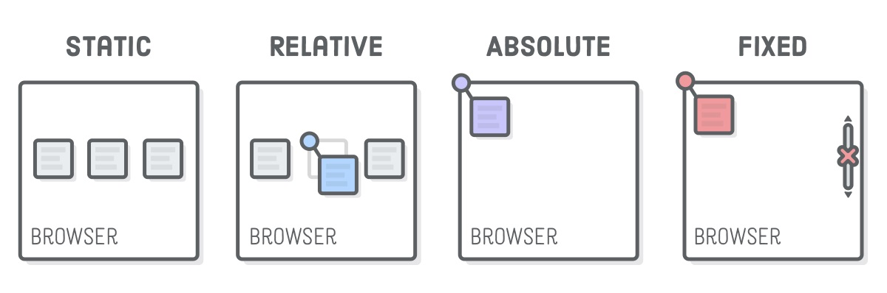
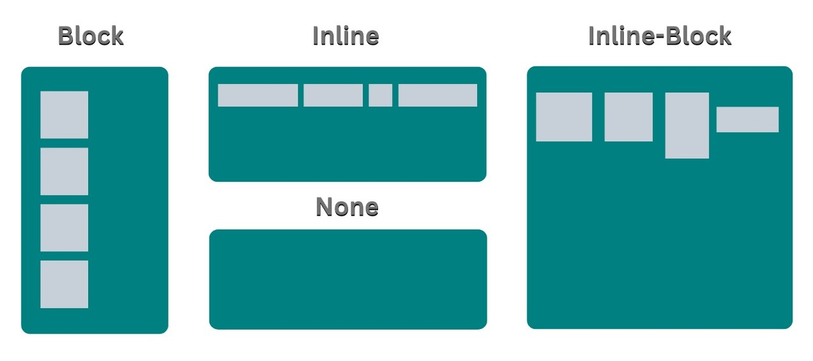
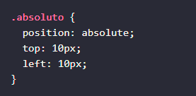
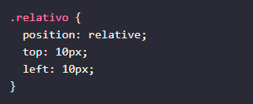
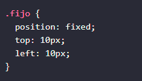
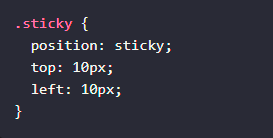
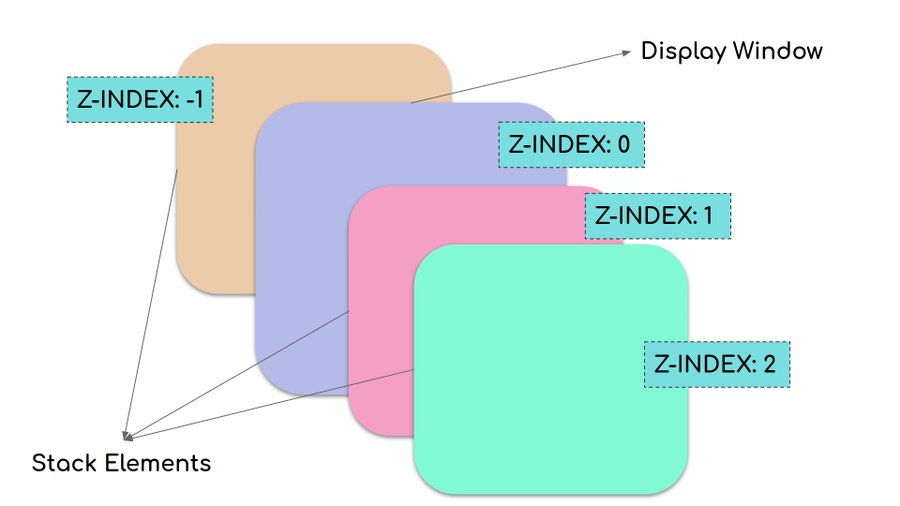
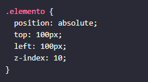

<!-- No borrar o modificar -->
[Inicio](./index.md)

## Sesión 10 


<!-- Su documentación aquí -->

# **Propiedades de posicionamiento de CSS**



La propiedad position de CSS determina cómo se posiciona un elemento en un documento. Hay cinco valores diferentes para la propiedad position:

- static: El elemento se posiciona de acuerdo con el flujo normal del documento.

- absolute: El elemento se posiciona de forma absoluta, es decir, se coloca en una posición específica en la página, independientemente del flujo normal del documento.

- relative: El elemento se posiciona de forma relativa, es decir, se desplaza desde su posición original en el flujo normal del documento.

- fixed: El elemento se posiciona de forma fija, es decir, se coloca en una posición específica en la ventana del navegador y permanece en esa posición incluso cuando el usuario se desplaza por la página.
Propiedades de visualización de CSS


# **Propiedades de visualización de CSS**



La propiedad display de CSS determina cómo se muestra un elemento en una página web. Hay cuatro valores diferentes para la propiedad display:

- block: El elemento se muestra como una caja de bloque, que ocupa toda la anchura de su contenedor y se muestra en una nueva línea.

- inline: El elemento se muestra como una caja de línea, que se muestra en la misma línea que el texto circundante.

- inline-block: El elemento se muestra como una caja de línea, pero puede tener una anchura y una altura definidas.

- none: El elemento no se muestra en la página web.


# **Ejemplos de uso de las propiedades de posicionamiento y visualización de CSS**

- Elemento posicionado de forma absoluta:



Este código posicionará el elemento .absoluto a 10 píxeles de la parte superior y izquierda de la ventana del navegador.

- Elemento posicionado de forma relativa:



Este código posicionará el elemento .relativo a 10 píxeles de su posición original en el flujo normal del documento.

- Elemento posicionado de forma fija:



Este código posicionará el elemento .fijo a 10 píxeles de la parte superior y izquierda de la ventana del navegador y permanecerá en esa posición incluso cuando el usuario se desplaza por la página.

- Elemento posicionado de forma sticky:



Este código posicionará el elemento .sticky a 10 píxeles de la parte superior de la ventana del navegador cuando el usuario se desplaza por la página, pero se volverá a comportar de forma normal cuando el usuario alcance el borde superior de la ventana del navegador.

# **Ejemplo de HTML donde se usan todas las clases CSS anteriores**

```
html

<!DOCTYPE html>
<html lang="es">
<head>
  <meta charset="UTF-8">
  <title>Ejemplo de posicionamiento y visualización de CSS</title>
  <style>
    .bloque {
      display: block;
      width: 200px;
      height: 100px;
      background-color: red;
    }

    .en línea {
      display: inline;
      width: 100px;
      height: 50px;
      background-color: green;
    }

    .inline-bloque {
      display: inline-block;
      width: 100px;
      height: 50px;
      background-color: blue;
    }

    .absoluto {
      position: absolute;
      top: 100px;
      left: 100px;
      background-color: yellow;
    }

    .relativo {
      position: relative;
      top: 100px;
      left: 100px;
      background-color: orange;
    }

    .fijo {
      position: fixed;
      top: 100px;
      left: 100px;
      background-color: pink;
    }

    .sticky {
      position: sticky;
      top: 100px;
      left: 100px;
      background-color: purple;
    }
  </style>
</head>
<body>
  <h1>Ejemplo de posicionamiento y visualización de CSS</h1>

  <div class="bloque">
    Este es un elemento de bloque.
  </div>

  <span class="en línea">
    Este es un elemento de línea.
  </span>

  <div class="inline-bloque">
    Este es un elemento de línea con ancho y altura definidos.
  </div>

  <div class="absoluto">
    Este elemento está posicionado de forma absoluta.
  </div>

  <div class="relativo">
    Este elemento está posicionado de forma relativa.
  </div>

  <div class="fijo">
    Este elemento está posicionado de forma fija.
  </div>

  <div class="sticky">
    Este elemento está posicionado de forma sticky.
  </div>
</body>
</html>

```

Este ejemplo muestra cómo las propiedades de posicionamiento y visualización de CSS afectan a la apariencia de los elementos HTML.

Elemento de bloque: El elemento .bloque se muestra como una caja de bloque, que ocupa toda la anchura de su contenedor y se muestra en una nueva línea.

Elemento de línea: El elemento .en línea se muestra como una caja de línea, que se muestra en la misma línea que el texto circundante.

Elemento de línea con ancho y altura definidos: El elemento .inline-bloque se muestra como una caja de línea con ancho y altura definidos.

Elemento posicionado de forma absoluta: El elemento .absoluto se posiciona de forma absoluta, es decir, se coloca en una posición específica en la página, independientemente del flujo normal del documento.

Elemento posicionado de forma relativa: El elemento .relativo se posiciona de forma relativa, es decir, se desplaza desde su posición original en el flujo normal del documento.

Elemento posicionado de forma fija: El elemento .fijo se posiciona de forma fija, es decir, se coloca en una posición específica en la ventana del navegador y permanece en esa posición incluso cuando el usuario se desplaza por la página.

Elemento posicionado de forma sticky: El elemento .sticky se posiciona de forma fija cuando el usuario se desplaza por la página, pero se vuelve a comportar de forma normal cuando el usuario alcanza el borde superior o inferior de la ventana del navegador.

# **La propiedad z-index**}



La propiedad z-index de CSS especifica el orden de apilamiento de un elemento posicionado y sus descendientes. Cuando varios elementos se superponen, los elementos con mayor valor z-index cubren aquellos con menor valor.

El valor de z-index puede ser un número entero positivo o negativo. Un valor de z-index de 0 significa que el elemento se comporta de forma normal, siguiendo el flujo normal del documento.

Por ejemplo, el siguiente código CSS establece el valor z-index de un elemento a 10:



Este código hará que el elemento .elemento se muestre en la parte superior de cualquier otro elemento posicionado en la página, independientemente de su posición original en el flujo normal del documento.

Aquí hay un ejemplo de cómo se puede usar la propiedad z-index para crear un efecto de tooltip:

```
html

<html lang="es">
<head>
  <meta charset="UTF-8">
  <title>Ejemplo de z-index</title>
  <style>
    .tooltip {
      position: absolute;
      top: 100px;
      left: 100px;
      z-index: 10;
      background-color: lightgray;
      padding: 10px;
      border-radius: 5px;
      display: none;
    }

    .elemento {
      position: relative;
      cursor: pointer;
    }

    .elemento:hover .tooltip {
      display: block;
    }
  </style>
</head>
<body>
  <h1>Ejemplo de z-index</h1>

  <div class="elemento">
    Este es un elemento con un tooltip.
  </div>

  <div class="tooltip">
    Este es el contenido del tooltip.
  </div>
</body>
</html>

```

En este ejemplo, el elemento .elemento tiene un tooltip que se muestra cuando el usuario lo pasa el cursor por encima. El tooltip está posicionado de forma absoluta y tiene un valor z-index de 10. Esto significa que el tooltip siempre se mostrará en la parte superior del elemento .elemento, independientemente de su posición original en el flujo normal del documento.

La propiedad z-index es una herramienta poderosa que se puede usar para crear una variedad de efectos de visualización.

# **Actividad: Propiedades de posicionamiento de CSS**

Objetivo:

Aplicar las propiedades de posicionamiento de CSS para crear diferentes efectos de visualización.

Instrucciones:

1. Crea un nuevo archivo HTML y CSS.
1. En el archivo HTML, crea una estructura básica de página web con dos elementos div.
1. En el archivo CSS, define las propiedades de visualización y posicionamiento de los elementos div.


Ejemplo:
```
html

<!DOCTYPE html>
<html lang="es">
<head>
  <meta charset="UTF-8">
  <title>Ejemplo de posicionamiento de CSS</title>
  <style>
    .elemento-1 {
      position: absolute;
      top: 100px;
      left: 100px;
      background-color: red;
    }

    .elemento-2 {
      position: relative;
      top: 100px;
      left: 100px;
      background-color: green;
    }
  </style>
</head>
<body>
  <div class="elemento-1"></div>
  <div class="elemento-2"></div>
</body>
</html>

```

Este ejemplo muestra dos elementos div posicionados de forma absoluta y relativa, respectivamente. El elemento .elemento-1 se posiciona a 100 píxeles de la parte superior y izquierda de la ventana del navegador, mientras que el elemento .elemento-2 se posiciona a 100 píxeles de su posición original en el flujo normal del documento.

Preguntas:

- ¿Cuál es la diferencia entre los valores position: absolute y position: relative?
- ¿Cómo se puede usar la propiedad z-index para controlar el orden de apilamiento de los elementos posicionados?
- ¿Cómo se puede usar la propiedad display para controlar cómo se muestra un elemento en una página web?

# **Solucion**

```
html

<!DOCTYPE html>
<html lang="es">
<head>
  <meta charset="UTF-8">
  <title>Actividad: Propiedades de posicionamiento de CSS</title>
  <style>
    .elemento-1 {
      position: absolute;
      top: 100px;
      left: 100px;
      background-color: red;
      width: 150px;
      height: 150px;
      color: rgb(23, 36, 3);
      text-align: center;
    }

    .elemento-2 {
      position: static;
      top: 230px;
      left: 230px;
      background-color: green;
      width: 200px;
      height: 200px;
      color: rgb(15, 196, 241);
      text-align: center;
    }
  </style>
</head>
<body>
  <div class="elemento-1">Elemento 1</div>
  <div class="elemento-2">Elemento 2</div>
</body>
</html>

```

 **Respuestas**

- ¿Cuál es la diferencia entre los valores position: absolute y position: relative?

absolute: El elemento se posiciona de forma absoluta, es decir, se coloca en una posición específica en la página, independientemente del flujo normal del documento.
relative: El elemento se posiciona de forma relativa, es decir, se desplaza desde su posición original en el flujo normal del documento.

- ¿Cómo se puede usar la propiedad z-index para controlar el orden de apilamiento de los elementos posicionados?

La propiedad z-index en CSS se utiliza para controlar el orden de apilamiento de elementos posicionados, es decir, cómo se superponen entre sí cuando tienen propiedades de posición diferentes de static (el valor predeterminado). Puedes usar z-index para determinar qué elemento se superpone a cuál. 

La propiedad z-index en CSS controla qué elemento se superpone a cuál. Un valor de z-index más alto hace que un elemento esté por encima de los elementos con valores más bajos. Si no se especifica, los elementos se superpondrán en función del orden en el código HTML. Usar z-index es útil para controlar el orden de apilamiento de elementos posicionados.

- ¿Cómo se puede usar la propiedad display para controlar cómo se muestra un elemento en una página web?

La propiedad display en CSS se utiliza para controlar cómo se muestra un elemento en una página web. Puedes cambiar el valor de esta propiedad para alterar la forma en que un elemento se comporta y se muestra en el diseño de la página.

1. display: block;: El elemento se muestra como un bloque rectangular que ocupa todo el ancho disponible. Los elementos de bloque comienzan en una nueva línea y se apilan verticalmente.

1. display: inline;: El elemento se muestra en línea con el texto circundante, sin iniciar una nueva línea. El ancho y alto del elemento se ajustan al contenido dentro de él.

1. display: inline-block;: Combina las características de block e inline. El elemento se muestra en línea, pero permite establecer un ancho y alto, lo que lo hace útil para crear diseños más complejos.

1. display: none;: El elemento no se muestra en absoluto y se elimina del diseño, ocupando cero espacio en la página.

1. display: flex;: Crea un contenedor flexible que organiza los elementos secundarios en filas o columnas, lo que facilita la creación de diseños flexibles.

1. display: grid;: Crea un contenedor de diseño en forma de cuadrícula, que te permite organizar elementos en filas y columnas de manera más precisa y controlada.

1. display: inline-flex; y display: inline-grid;: Son versiones en línea de los valores flex y grid, lo que permite que estos contenedores se muestren en línea con el texto circundante.