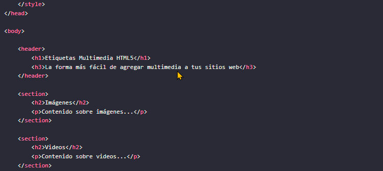

<!-- No borrar o modificar -->
[Inicio](./index.md)

# **Sesión 3** 

<!-- Su documentación aquí -->

# **Etiquetas multimedia HTML**
Las etiquetas multimedia HTML son una forma de agregar contenido multimedia a una página web. Las etiquetas multimedia más comunes son:

**img:** Esta etiqueta se utiliza para agregar imágenes a una página web. El atributo src especifica la URL de la imagen, y el atributo alt proporciona una descripción alternativa de la imagen en caso de que no se cargue.

**video:** Esta etiqueta se utiliza para agregar videos a una página web. El atributo src especifica la URL del video, y el atributo controls muestra los controles del video.

**audio:** Esta etiqueta se utiliza para agregar audio a una página web. El atributo src especifica la URL del audio, y el atributo controls muestra los controles del audio.

**iframe:** Esta etiqueta se utiliza para agregar una ventana de otra página web a una página web. El atributo src especifica la URL de la página web que se desea insertar, y el atributo width y height especifican el ancho y el alto de la ventana.

# **Etiqueta img**
La etiqueta img se utiliza para agregar imágenes a una página web. El atributo src especifica la URL de la imagen, y el atributo alt proporciona una descripción alternativa de la imagen en caso de que no se cargue.

Ejemplo:

()

En este ejemplo, la imagen imagen.jpg se agregará a la página web. Si la imagen no se puede cargar, la descripción alternativa Esta es una descripción de la imagen se mostrará en su lugar.

Otros atributos:

La etiqueta img también admite otros atributos, como:

**width:** El ancho de la imagen.

**height:** La altura de la imagen.

**title:** El título de la imagen.

Puede usar estos atributos para personalizar el aspecto de la imagen en su página web.

**Etiqueta video**

La etiqueta video se utiliza para agregar videos a una página web. El atributo src especifica la URL del video, y el atributo controls muestra los controles del video.

Ejemplo:

(<video src="video.mp4" controls></video>)

En este ejemplo, el video video.mp4 se agregará a la página web. Los controles del video, como el botón de reproducción, el botón de pausa y el botón de avance rápido, se mostrarán debajo del video.

Otros atributos:

La etiqueta video también admite otros atributos, como:

**width:** El ancho del video.

**height:** La altura del video.

**poster:** La URL de la imagen que se mostrará antes de que comience a reproducirse el video.

**autoplay:** Si el video debe reproducirse automáticamente cuando se cargue la página.

**loop:** Si el video debe reproducirse en bucle.

**muted:** Si el video debe reproducirse en silencio.

Puede usar estos atributos para personalizar el aspecto y el comportamiento del video en su página web.
Etiqueta audio
La etiqueta audio se utiliza para agregar audio a una página web. El atributo src especifica la URL del audio, y el atributo controls muestra los controles del audio.

Ejemplo:

(<audio src="audio.mp3" controls></audio>)

En este ejemplo, el audio audio.mp3 se agregará a la página web. Los controles del audio, como el botón de reproducción, el botón de pausa y el botón de avance rápido, se mostrarán debajo del audio.

Otros atributos:

La etiqueta audio también admite otros atributos, como:

**width:** El ancho del audio.

**height:** La altura del audio.

**poster:** La URL de la imagen que se mostrará antes de que comience a reproducirse el audio.

**autoplay:** Si el audio debe reproducirse automáticamente cuando se cargue la página.

**loop:** Si el audio debe reproducirse en bucle.

**muted:** Si el audio debe reproducirse en silencio.

Puede usar estos atributos para personalizar el aspecto y el comportamiento del audio en su página web.

**Etiqueta iframe**

La etiqueta iframe se utiliza para agregar una ventana de otra página web a una página web. El atributo src especifica la URL de la página web que se desea insertar, y el atributo width y height especifican el ancho y el alto de la ventana.

Ejemplos:
(
<iframe src="otra-pagina.html" width="500" height="300"></iframe>
)
En este ejemplo, la página web otra-pagina.html se agregará a la página web actual. La ventana tendrá un ancho de 500 píxeles y una altura de 300 píxeles.

(
<iframe width="560" height="315" src="https://www.youtube.com/embed/v64KOxKVLVg" frameborder="0"
            allow="accelerometer; autoplay; encrypted-media; gyroscope; picture-in-picture" allowfullscreen></iframe>
)

El fragmento de código HTML es un ejemplo de cómo incrustar un video de YouTube en una página web utilizando la etiqueta <iframe>. Aquí tienes una explicación detallada de los atributos y su función en este código:

(width="560" y height="315":) Estos atributos definen el ancho y la altura del iframe en píxeles. En este caso, el iframe tendrá un ancho de 560 píxeles y una altura de 315 píxeles.

**src=** "https://www.youtube.com/embed/v64KOxKVLVg": El atributo src especifica la URL del recurso incrustado. En este caso, la URL apunta a un video de YouTube con el identificador "v64KOxKVLVg". La parte /embed/ en la URL indica que se está incrustando un video.

**frameborder="0":** Este atributo define si se debe mostrar o no un borde alrededor del iframe. En este caso, se establece en "0" para que no se muestre ningún borde.

**allow=**"accelerometer; autoplay; encrypted-media; gyroscope; picture-in-picture": El atributo allow especifica qué características del navegador están permitidas cuando se reproduce el contenido incrustado. Las opciones aquí indican que se permiten el uso del acelerómetro, la reproducción automática, la reproducción de medios encriptados, el giroscopio y la función "picture-in-picture" (imagen en imagen).

**allowfullscreen:** Este atributo permite que el iframe se expanda a pantalla completa cuando el usuario haga clic en el botón de pantalla completa en el reproductor de video.

Otros atributos:

La etiqueta iframe también admite otros atributos, como:

**frameborder:** El ancho del borde alrededor del iframe.

**scrolling:** Si el iframe debe tener barras de desplazamiento.

**allowtransparency:** Si el iframe debe ser transparente.

**sandbox:** Una lista de restricciones que se aplican al iframe.

Puede usar estos atributos para personalizar el aspecto y el comportamiento del iframe en su página web.

**Nota:**

Los iframes se utilizan a menudo para incrustar contenido de otras páginas web en su propia página web. Sin embargo, los iframes también pueden ser utilizados para fines maliciosos, como inyectar código malicioso en su página web. Por lo tanto, es importante utilizar los iframes con cuidado.

Los iframes no son compatibles con todos los navegadores.

# **Recursos:**

**Unsplash**

Unsplash es un sitio web que ofrece fotos de alta calidad libres de regalías. Las fotos de Unsplash se pueden usar para cualquier propósito, personal o comercial, sin necesidad de atribución. El sitio web fue fundado en 2013 por Mikael Cho y Viktor Krastev, y desde entonces ha crecido hasta convertirse en uno de los sitios web de fotos libres de regalías más populares del mundo.

https://unsplash.com/es/explora

**Pixabay**

Pixabay es un sitio web que ofrece imágenes, videos y música libres de regalías. Las imágenes, videos y música de Pixabay se pueden usar para cualquier propósito, personal o comercial, sin necesidad de atribución. El sitio web fue fundado en 2010 por Hans Böck y se ha convertido en uno de los sitios web de medios libres más populares del mundo.

https://pixabay.com/es/

**IconArchive**

IconArchive es un sitio web que ofrece iconos gratuitos y de alta calidad para web y aplicaciones. Los iconos de IconArchive se pueden descargar en una variedad de formatos, incluyendo PNG, SVG, ICO y ICNS.

https://www.iconarchive.com/

# **Este código HTML está creando una página web con diferentes elementos multimedia, incluyendo:**

- Etiquetas de encabezado <h1> y <h2> para títulos.

- Párrafos 
 con descripciones.

- Una imagen 

- Un video <video> con controles.

- Un audio <audio> con controles.

- Un iframe de YouTube.

También tiene definidos estilos CSS dentro de la etiqueta <style> que incluyen:

- Centrar los títulos y párrafos.

- Dar formato a la imagen para centrarla y asignarle un ancho.

- Aplicar reglas a los elementos multimedia para centrarlos, asignarles ancho/alto y espaciado inferior.

# **Actividad: Adición de contenido multimedia en un sitio web utilizando etiquetas HTML5**

Completa el siguiente código HTML añadiendo el contenido multimedia correspondiente en cada sección:

- 4 Imagenes

- 2 vídeos

- 4 Audios

- 2 marco en línea

- Utiliza encabezados para títulos en cada elemento (<h1>...<h6>).

Crea una descripción para cada elemento utilizando párrafos (
).

Además, puedes emplear las siguientes etiquetas para mejorar la estructura y estilo de tu contenido:

- Usa <strong> para resaltar texto importante.

- Utiliza   para insertar saltos de línea si es necesario.

- Agrega  para aplicar estilos específicos a porciones de texto.

- Emplea <i> para enfatizar o dar énfasis a palabras o frases.

- Utiliza <u> para subrayar texto cuando sea necesario.

- Considera el uso de 
 para crear secciones o contenedores para tu contenido, lo que puede facilitar la organización y el diseño de la página.

# **Plantilla Inicial**

# **Semántica y Estructura de la Plantilla**

El código HTML y CSS proporcionado describe un sitio web que trata sobre etiquetas multimedia en HTML5. A continuación, se desglosa la semántica y estructura del sitio:

<!DOCTYPE html>: Esto define el tipo de documento como HTML5.

(<html>:) La etiqueta raíz que envuelve todo el contenido HTML del sitio.

(<head>:) Aquí se encuentran las metainformaciones y enlaces a recursos externos. En este caso, se define el título de la página y se incluye un bloque <style> para agregar reglas de estilo CSS.

(<title>:) Establece el título de la página en la pestaña del navegador.

(style:) Contiene reglas de estilo CSS que afectan al diseño y la apariencia del sitio.

(<body>:) Aquí se coloca el contenido principal visible de la página.

(<header>:) Sección de encabezado que contiene el título principal y un subtítulo.

(<h1> y <h3>:) Encabezados de nivel 1 y 3, respectivamente, que proporcionan títulos jerárquicos y estructuran la información del encabezado.

(<section>:) Define una sección de contenido temático. Se utilizan para agrupar información relacionada.

(<h2>:) Encabezado de nivel 2 que se utiliza para los títulos de las secciones de contenido.

(
:) Párrafo de texto que contiene contenido informativo sobre las imágenes, videos, audios y iframes.

(<footer>:) Pie de página que contiene información de autoría y derechos de autor. Incluye saltos de línea 

( ) para separar las líneas de texto.

En cuanto al estilo, el CSS define reglas para la apariencia visual del sitio:

La fuente del cuerpo del sitio es Arial o una fuente sans-serif en caso de que Arial no esté disponible.
El encabezado (<header>) tiene un fondo oscuro, texto blanco y un espacio de relleno.
Cada sección (<section>) tiene un borde, un espacio de relleno y un margen inferior.
Los encabezados de nivel 1 y 3 están centrados.
Los encabezados de nivel 2 (<h2>) tienen color azul.
El pie de página (<footer>) tiene un fondo oscuro, texto blanco, espacio de relleno y está centrado.
Este sitio utiliza HTML5 y CSS para presentar información sobre etiquetas multimedia en HTML5, con una estructura semántica que utiliza encabezados, párrafos y secciones para organizar y presentar el contenido. El estilo CSS proporciona una apariencia visual coherente y agradable.

# **Solucion**

[index](https://drive.google.com/drive/u/0/folders/1AOoFXQg2eCrF9iIiNpO0EpixpdaRHvSa)