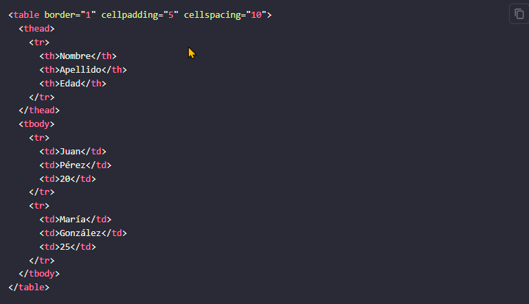
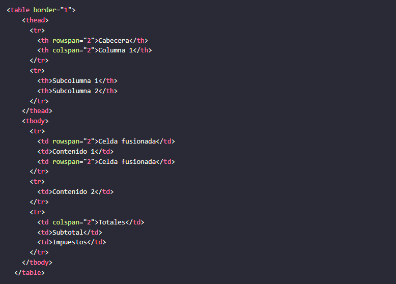
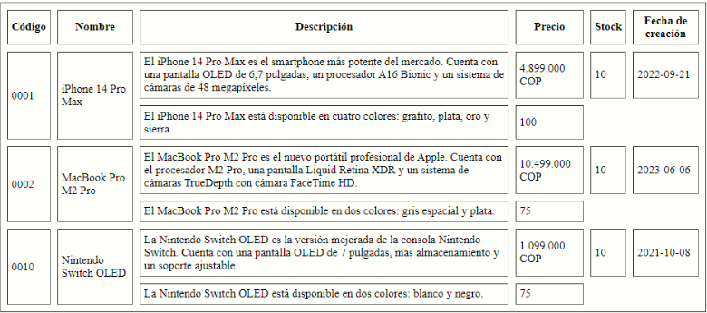

<!-- No borrar o modificar -->
[Inicio](./index.md)

## Sesión 4

<!-- Su documentación aquí -->

# **Tablas en HTML5**

Las tablas HTML se utilizan para mostrar datos en formato tabular. Se componen de filas (<tr>) y columnas (<td> o <th>).

- <table>: Esta etiqueta representa la tabla en su conjunto. Dentro de ella deben incluirse las etiquetas <tr> y <td> o <th>.
- <tr>: Esta etiqueta representa una fila de la tabla. Dentro de ella deben incluirse las etiquetas <td> o - - <th>.
- <td>: Esta etiqueta representa una celda de la tabla que contiene datos.
- <th>: Esta etiqueta representa una celda de la tabla que contiene encabezados.

# **<table>**

En HTML5, la etiqueta <table> se utiliza para representar una tabla. Las tablas se utilizan para mostrar datos de forma organizada en filas y columnas.

La etiqueta <table> tiene una serie de atributos que se pueden utilizar para personalizar su apariencia y comportamiento. Estos atributos incluyen:

- border: Este atributo especifica el ancho del borde de la tabla.

- cellpadding: Este atributo especifica el espacio entre el contenido de una celda y su borde.

- cellspacing: Este atributo especifica el espacio entre las celdas de una tabla.

- align: Este atributo especifica la alineación del contenido de la tabla.

- valign: Este atributo especifica la alineación vertical del contenido de la tabla.
Además de los atributos mencionados anteriormente, la etiqueta <table> tiene un atributo obsoleto llamado bgcolor. Este atributo se utilizaba para especificar el color de fondo de la tabla. En HTML5, el color de fondo de la tabla se puede especificar utilizando CSS.

# **<thead> y <tbody>**

Las etiquetas <thead> y <tbody> se utilizan para organizar el contenido de la tabla en secciones.

- <thead>: Esta etiqueta representa la cabecera de la tabla.

- <tbody>: Esta etiqueta representa el cuerpo de la tabla.

# **<tr>, <td> y <th>**

Las tablas HTML se componen de filas y columnas. Las filas se definen mediante la etiqueta <tr> y las columnas se definen mediante la etiqueta <td> o <th>.

La etiqueta <td> se utiliza para representar una celda de datos. La etiqueta <th> se utiliza para representar una celda de encabezado.

Las celdas de una tabla se pueden combinar utilizando los atributos colspan y rowspan. El atributo colspan especifica la cantidad de columnas que una celda ocupará. El atributo rowspan especifica la cantidad de filas que una celda ocupará.

A continuación se muestra un ejemplo de una tabla HTML:

# **Atributos colspan y rowspan**

Los atributos colspan y rowspan se utilizan en HTML para combinar celdas de una tabla. El atributo colspan especifica la cantidad de columnas que una celda ocupará, mientras que el atributo rowspan especifica la cantidad de filas que una celda ocupará.

Ejemplo

# **Actividad: Crear una tabla HTML con información sobre productos.**

Escribir una tabla HTML con 10 filas que muestre información sobre productos reales. La tabla debe tener las siguientes columnas:

- Código

- Nombre

- Descripción

- Precio

- Existencias

- Fecha de creación

Además, combinar celdas en la tabla con los atributos rowspan y colspan, como se muestra en la siguiente imagen.

## **Solucion**

[TABLA](https://drive.google.com/drive/u/0/folders/1R6f0jr-wA_4-1L1Z8_RShK3Oe-gRJ6Xd)