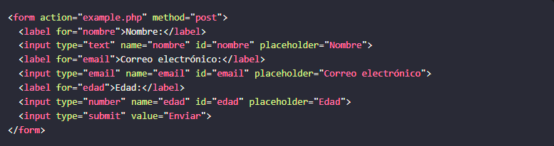

<!-- No borrar o modificar -->
[Inicio](./index.md)

## Sesión 5 

<!-- Su documentación aquí -->

# **Formulario HTML**

Los formularios HTML son elementos de una página web que permiten a los usuarios introducir datos. Estos datos pueden ser enviados a un servidor web para su procesamiento, o pueden utilizarse para realizar acciones en el lado del cliente.

Los formularios HTML están formados por uno o más controles de formulario. Los controles de formulario son elementos que permiten a los usuarios introducir datos de diferentes tipos, como texto, números, fechas, etc.

# **Diseñó de un formulario**

Al diseñar un formulario HTML, hay una serie de factores a tener en cuenta:

- La finalidad del formulario: ¿Qué datos desea recopilar del usuario? ¿Cómo se utilizarán estos datos?

- El público objetivo: ¿Quién utilizará el formulario? ¿Qué nivel de alfabetización tecnológica tienen?

- La usabilidad: El formulario debe ser fácil de usar y comprender.

# **Ejemplo de formulario**

# **Etiqueta de formularios**

## **La etiqueta <form>**

La etiqueta <form> en HTML5 define un formulario web. Un formulario web es un elemento de una página web que permite a los usuarios introducir datos. Estos datos pueden ser enviados a un servidor web para su procesamiento, o pueden utilizarse para realizar acciones en el lado del cliente.

La etiqueta <form> tiene los siguientes atributos obligatorios:

- action: Especifica la URL del archivo en el servidor web al que se enviarán los datos del formulario.

- method: Especifica el método HTTP que se utilizará para enviar los datos del formulario. Los métodos HTTP más comunes son post y get.

La etiqueta <form> también tiene los siguientes atributos opcionales:

- enctype: Especifica el tipo de codificación de datos que se utilizará para enviar los datos del formulario.

- name: Especifica el nombre del formulario. Este nombre se utiliza para identificar el formulario en el código del servidor.

- autocomplete: Especifica si el navegador debe rellenar automáticamente los campos del formulario.

# **La etiqueta <label>**

La etiqueta <label> de HTML se utiliza para asociar una etiqueta con un elemento de formulario. La etiqueta <label> se utiliza para proporcionar una etiqueta para un control de entrada, lo que ayuda a los usuarios a comprender la función del control de entrada.

La etiqueta <label> tiene los siguientes atributos obligatorios:

- for: Especifica el id del elemento de formulario al que se asocia la etiqueta. La etiqueta <label> también tiene los siguientes atributos opcionales:

- accesskey: Especifica una tecla de acceso para la etiqueta.

- tabindex: Especifica el índice de tabulación de la etiqueta.

Para asociar una etiqueta con un control de entrada, colocamos la etiqueta <label> junto al control de entrada y especificamos el id del control de entrada en el atributo for de la etiqueta <label>.

Por ejemplo, el siguiente código crea un checkbox con el nombre "intereses" y el valor "deporte" y lo asocia con una etiqueta con el texto "Deportes":

La etiqueta "Deportes" se muestra junto al checkbox. Cuando el usuario hace clic en el checkbox, la etiqueta "Deportes" también se activa.

El atributo for de la etiqueta <label> es obligatorio para que la etiqueta <label> funcione correctamente. Si no especificamos el atributo for, la etiqueta <label> no se asociará con ningún elemento de formulario.

La etiqueta <label> es una herramienta importante para mejorar la accesibilidad de los formularios web. Al asociar una etiqueta con un control de entrada, podemos proporcionar una etiqueta para el control de entrada, lo que ayuda a los usuarios a comprender la función del control de entrada.

# **La etiqueta input**

La etiqueta input de HTML se utiliza para crear controles interactivos para formularios web. Los controles de entrada pueden ser campos de texto, botones de radio, casillas de verificación, listas desplegables, etc.

La etiqueta input tiene los siguientes atributos obligatorios:

type: Especifica el tipo de control de entrada. Los tipos de control de entrada más comunes son text, password, radio, checkbox, submit, reset y file. name: Especifica el nombre del control de entrada. Este nombre se utiliza para identificar el control de entrada en el código del servidor. La etiqueta input también tiene los siguientes atributos opcionales:

- value: Especifica el valor inicial del control de entrada.

- checked: Especifica si el control de entrada está marcado o no.

- disabled: Especifica si el control de entrada está deshabilitado o no.

- readonly: Especifica si el control de entrada es de solo lectura o no.

- size: Especifica el tamaño del control de entrada.

- maxlength: Especifica la longitud máxima del valor del control de entrada.

- placeholder: Especifica un texto que se muestra en el control de entrada cuando está vacío.

- autocomplete: Especifica si el navegador debe rellenar automáticamente el control de entrada.

- autofocus: Especifica el control de entrada que debe tener el foco cuando la página se carga.

Además de estos atributos, la etiqueta input también admite una serie de atributos aria para mejorar la accesibilidad de los controles de entrada para las personas con discapacidades.

## **Ejemplos de la etiqueta input:**

**Texto**

**Contraseña**

**Casilla de verificación**

**Botón de reinicio**

**Archivo**

**Fecha**

**Hora**

**Fecha y hora**

**Semana**

**Teléfono**

**URL**

**Correo electronico**

**Número**

## **Ejemplos de tipos de etiqueta input**

# **La etiqueta textarea**

La etiqueta textarea HTML5 se utiliza para crear un control de entrada de texto de varias líneas. Los textarea input se utilizan a menudo para recopilar comentarios, reseñas, o otro tipo de texto largo.

La etiqueta textarea tiene los siguientes atributos:

- name: Especifica el nombre del control de entrada. El nombre del control de entrada se utiliza para 

- identificar el control de entrada en el formulario.

- id: Especifica el ID del control de entrada. El ID del control de entrada se utiliza para identificar el control de entrada en el código JavaScript.

- placeholder: Especifica un texto predeterminado que se muestra en el control de entrada cuando está vacío.

- rows: Especifica el número de filas del textarea input.

- cols: Especifica el número de columnas del textarea input.

- maxlength: Especifica la longitud máxima del texto que se puede ingresar en el textarea input.

- minlength: Especifica la longitud mínima del texto que se puede ingresar en el textarea input.

- required: Especifica si el textarea input es obligatorio.

- disabled: Especifica si el textarea input está deshabilitado.

- readonly: Especifica si el textarea input está bloqueado para escritura.

El siguiente código muestra un ejemplo de textarea input HTML5:

Este código creará un textarea input con 10 filas y 50 columnas. El usuario podrá ingresar hasta 500 caracteres en el textarea input.

Los textarea input HTML5 son una herramienta útil para recopilar texto largo de los usuarios.

# **La etiqueta select**

La etiqueta select HTML5 se utiliza para crear un menú desplegable. Los menús desplegables se utilizan a menudo para recopilar una selección de opciones de los usuarios.

La etiqueta select tiene los siguientes atributos:

- name: Especifica el nombre del control de entrada. El nombre del control de entrada se utiliza para identificar el control de entrada en el formulario.

- id: Especifica el ID del control de entrada. El ID del control de entrada se utiliza para identificar el control de entrada en el código JavaScript.

- multiple: Especifica si el usuario puede seleccionar más de una opción del menú desplegable.

- size: Especifica el número de opciones que se muestran en el menú desplegable de forma predeterminada.

- required: Especifica si el menú desplegable es obligatorio.

- disabled: Especifica si el menú desplegable está deshabilitado.

- readonly: Especifica si el menú desplegable está bloqueado para escritura.

El siguiente código muestra un ejemplo de select input HTML5:

Este código creará un menú desplegable con tres opciones: rojo, verde y azul. El usuario puede seleccionar una opción del menú desplegable.

También puede utilizar el atributo multiple para permitir que el usuario seleccione más de una opción del menú desplegable. Por ejemplo, el siguiente código creará un menú desplegable con tres opciones, y el usuario podrá seleccionar todas las opciones que desee:

Los menús desplegables HTML5 son una herramienta útil para recopilar una selección de opciones de los usuarios.

La etiqueta option
La etiqueta option HTML5 se utiliza para crear una opción en un menú desplegable. Las opciones se utilizan para recopilar una selección de opciones de los usuarios.

La etiqueta option tiene los siguientes atributos:

- value: Especifica el valor de la opción. El valor de la opción se envía al servidor cuando el usuario selecciona la opción.

- label: Especifica el texto que se muestra en la opción.

- selected: Especifica si la opción está seleccionada de forma predeterminada.

- disabled: Especifica si la opción está deshabilitada.

- readonly: Especifica si la opción está bloqueada para escritura.

El siguiente código muestra un ejemplo de etiqueta option HTML5:

Este código creará tres opciones de menú desplegable: rojo, verde y azul. El atributo value especifica el valor de cada opción. El atributo label especifica el texto que se muestra en cada opción.

También puede utilizar el atributo selected para seleccionar una opción de forma predeterminada. Por ejemplo, el siguiente código seleccionará la opción rojo de forma predeterminada:

Las etiquetas option HTML5 son una herramienta útil para recopilar una selección de opciones de los usuarios.

La etiqueta button
La etiqueta button HTML5 se utiliza para crear un botón. Los botones se utilizan para realizar acciones, como enviar un formulario, abrir una nueva pestaña o ventana, o iniciar un proceso.

La etiqueta button tiene los siguientes atributos:

- type: Especifica el tipo de botón. Los tipos de botón comunes incluyen submit, reset, y button.

- name: Especifica el nombre del botón. El nombre del botón se utiliza para identificar el botón en el formulario.

- id: Especifica el ID del botón. El ID del botón se utiliza para identificar el botón en el código JavaScript.

- value: Especifica el valor del botón. El valor del botón se envía al servidor cuando el usuario hace clic en el botón.

- disabled: Especifica si el botón está deshabilitado.

El siguiente código muestra un ejemplo de etiqueta button HTML5:

Este código creará un botón que dice "Enviar". El botón es del tipo submit, lo que significa que enviará el formulario al servidor cuando el usuario haga clic en él. El valor del botón es "Enviar", que se enviará al servidor cuando el usuario haga clic en el botón.

También puede utilizar el atributo type para especificar el tipo de botón. Los tipos de botón comunes incluyen:

- submit: Este tipo de botón envía el formulario al servidor cuando el usuario hace clic en él.

- reset: Este tipo de botón restablece el formulario a su estado inicial cuando el usuario hace clic en él.

- button: Este tipo de botón no tiene una función predefinida. El botón se puede utilizar para realizar cualquier acción deseada.

Los botones HTML5 son una herramienta útil para realizar acciones en una página web.

