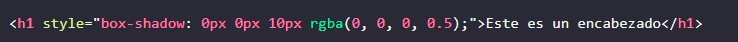
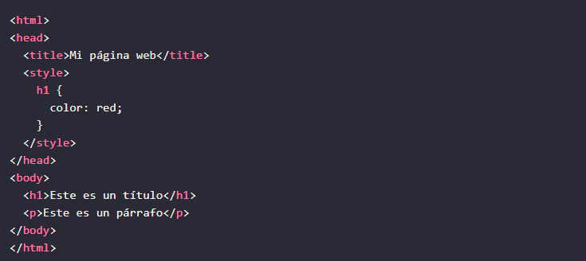
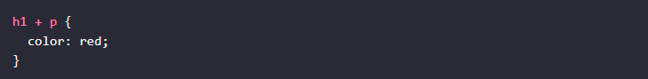

<!-- No borrar o modificar -->
[Inicio](./index.md)

## Sesión 8 


<!-- Su documentación aquí -->


# **CSS**

CSS, o Cascading Style Sheets, es un lenguaje de diseño gráfico para definir y crear la presentación de un documento estructurado escrito en un lenguaje de marcado, como HTML o XML. CSS se utiliza para dar estilo a las páginas web, por ejemplo, alterando la fuente, color, tamaño y espaciado del contenido, dividiendo el contenido en múltiples columnas o agregando animaciones y otras características decorativas.

CSS es un lenguaje de hojas de estilo que se utiliza para describir cómo se mostrará un documento HTML. CSS se aplica a un documento HTML en forma de hojas de estilo. Una hoja de estilo CSS es un archivo de texto que contiene instrucciones sobre cómo se debe mostrar un documento HTML.

CSS es un lenguaje poderoso que se puede utilizar para crear diseños web muy complejos y sofisticados. Con un buen conocimiento de CSS, puede crear páginas web que sean atractivas, informativas y fáciles de usar.

# **Funciones de CSS**

CSS tiene una serie de funciones, entre las que se incluyen:

- Controlar el aspecto de los elementos HTML: CSS se puede utilizar para cambiar el aspecto de los elementos HTML, como su color, tamaño, fuente y posición.

- Crear layouts: CSS se puede utilizar para crear layouts de páginas web, como columnas, filas y tablas.

- Agregar efectos: CSS se puede utilizar para agregar efectos a las páginas web, como animaciones, transiciones y sombras.

- Soportar dispositivos móviles: CSS se puede utilizar para crear páginas web que se vean bien en dispositivos móviles.

# **Sintaxis de CSS**

La sintaxis de CSS es relativamente simple. Las reglas CSS se componen de dos partes: una selector y una declaración.

El selector identifica los elementos HTML a los que se aplicará la regla. El declaración especifica el estilo que se aplicará a los elementos seleccionados.

Por ejemplo, la siguiente regla CSS cambiará el color de todos los elementos h1 a rojo:


En este caso, el selector es h1 y la declaración es color: red.

CSS vs. HTML

HTML y CSS son dos lenguajes diferentes que se utilizan para crear páginas web. HTML es un lenguaje de marcado que se utiliza para estructurar el contenido de una página web. CSS es un lenguaje de diseño gráfico que se utiliza para dar estilo a la página web.

HTML y CSS trabajan juntos para crear páginas web. HTML proporciona la estructura y el contenido de la página web, mientras que CSS proporciona el estilo.

# **Uso de CSS**

CSS se puede usar de varias maneras. Puede agregar CSS a su documento HTML de forma inline, interna o externa.

# **CSS inline**

CSS inline es un tipo de CSS que se aplica a un elemento HTML individual. Se utiliza agregando el atributo style al elemento HTML. El atributo style contiene una lista de propiedades CSS y sus valores.

Por ejemplo, el siguiente código aplica CSS inline a un elemento h1:


En este caso, el CSS inline cambiará el color del elemento <h1> a rojo.

CSS inline es útil para aplicar estilos únicos a elementos HTML individuales. Sin embargo, no se recomienda usar CSS inline para aplicar estilos a todos los elementos de un tipo determinado. En su lugar, se recomienda usar CSS interno o CSS externo para aplicar estilos globales.

Aquí hay algunos ejemplos de cómo usar CSS inline:

Para aplicar un color de fondo a un párrafo:


Para aplicar un estilo de borde a una imagen:
 


Para aplicar un efecto de sombra a un encabezado:



# **CSS interno**


El CSS interno se agrega directamente al documento HTML. El CSS interno se coloca entre las etiquetas style y /style.

Por ejemplo, el siguiente código agrega CSS interno a un documento HTML:


En este caso, el CSS interno cambia el color de todos los elementos h1 a rojo.

# **CSS externo**

El CSS externo se almacena en un archivo separado del documento HTML. El archivo de CSS se vincula al documento HTML mediante la etiqueta link.

Por ejemplo, el siguiente código vincula un archivo de CSS externo a un documento HTML:


En este caso, el archivo de CSS externo mi-estilo.css se vincula al documento HTML. El CSS externo cambiará el color de todos los elementos <h1> a rojo.

# **Selectores CSS**

Los selectores CSS son patrones que se utilizan para seleccionar los elementos HTML a los que se desea aplicar un estilo. Hay muchos tipos diferentes de selectores CSS, cada uno con su propia sintaxis y utilidad.

Selectores de etiqueta
Los selectores de etiqueta se utilizan para seleccionar todos los elementos de un tipo determinado. La sintaxis es simplemente el nombre de la etiqueta HTML. Por ejemplo, el siguiente selector seleccionaría todos los elementos h1:


Este selector aplicaría el estilo color: red a todos los elementos h1 de la página web.

Ejemplo HTML:



# **Selectores de identificación**

Los selectores de identificación se utilizan para seleccionar elementos HTML en función de su identificador. Los identificadores son atributos HTML que se utilizan para identificar elementos específicos. La sintaxis de un selector de identificación es el símbolo de hash (#) seguido del identificador del elemento.

Ejemplos

El siguiente selector seleccionaría el elemento con el identificador mi-id:


Los selectores de identificación son muy útiles para seleccionar elementos específicos. Se pueden utilizar para aplicar estilos a elementos individuales o a grupos de elementos.

Ejemplo HTML


# **Selectores de clase**

Los selectores de clase se utilizan para seleccionar todos los elementos que tienen una clase específica. La sintaxis es el punto (.) seguido del nombre de la clase. Por ejemplo, el siguiente selector seleccionaría todos los elementos que tengan la clase mi-clase:


Este selector aplicaría el estilo font-size: 20px a todos los elementos que tengan la clase mi-clase de la página web.


# **Selectores de jerarquía**

Los selectores de jerarquía se utilizan para seleccionar elementos HTML en función de su relación con otros elementos. Hay dos tipos de selectores de jerarquía:

- Selectores descendientes: Seleccionan todos los elementos que son descendientes de un elemento específico.

- Selectores hermanos: Seleccionan todos los elementos que son hermanos de un elemento específico.
Selectores descendientes
Los selectores descendientes se utilizan para seleccionar todos los elementos que están dentro de un elemento específico. La sintaxis de un selector descendiente es el nombre de la etiqueta seguido de un espacio y el nombre de la etiqueta del elemento descendiente.

Ejemplos

El siguiente selector seleccionaría todos los elementos p que están dentro de un elemento div:


Este selector aplicaría el estilo color: red a todos los elementos p que están dentro de un elemento div.

Explicación

Los selectores descendientes son muy útiles para aplicar estilos a grupos de elementos. Se pueden utilizar para aplicar estilos a todos los elementos de un tipo dentro de otro elemento.

Ejemplo HTML


En este ejemplo, el selector div p seleccionaría los dos elementos p que están dentro del elemento div.

Combinación con otros selectores
Los selectores descendientes se pueden combinar con otros selectores para crear reglas CSS más complejas. Por ejemplo, el siguiente selector seleccionaría todos los elementos p que están dentro de un elemento div con el identificador mi-div:


Este selector aplicaría el estilo color: red a todos los elementos p que están dentro del elemento div con el identificador mi-div.

# **Selectores hermanos**
Los selectores hermanos se utilizan para seleccionar todos los elementos que están al mismo nivel que un elemento específico. La sintaxis de un selector hermano es el nombre de la etiqueta seguido de un espacio y el nombre de la etiqueta del elemento hermano.

Ejemplos

El siguiente selector seleccionaría todos los elementos p que son hermanos de un elemento h1:



Este selector aplicaría el estilo color: red a todos los elementos p que son hermanos de un elemento h1.

Explicación

Los selectores hermanos son muy útiles para aplicar estilos a grupos de elementos que están relacionados entre sí. Se pueden utilizar para aplicar estilos a todos los elementos de un tipo que son hermanos de otro elemento.

Ejemplo HTML


En este ejemplo, el selector h1 + p seleccionaría los dos elementos p que son hermanos del elemento h1.

Combinación con otros selectores

Los selectores hermanos se pueden combinar con otros selectores para crear reglas CSS más complejas. Por ejemplo, el siguiente selector seleccionaría todos los elementos p que son hermanos de un elemento h1 con el identificador mi-h1:


Este selector aplicaría el estilo color: red a todos los elementos p que son hermanos del elemento h1 con el identificador mi-h1.

Ejemplo HTML


En este ejemplo, el selector #mi-id + p.mi-clase seleccionaría todos los elementos p que son hermanos del elemento h1 con el identificador mi-id y que tienen la clase mi-clase. En este caso, el selector seleccionaría el segundo elemento p.

**operadores de CSS:**

**Operador +**

El operador + se utiliza para seleccionar elementos que son hermanos inmediatos. Esto significa que los elementos seleccionados deben estar uno al lado del otro sin ningún otro elemento intermedio.

Ejemplo:


En este ejemplo, el selector #mi-id + p seleccionaría el segundo elemento p. Esto se debe a que el elemento p con la clase mi-clase es el único elemento p que es hermano inmediato del elemento h1 con el identificador mi-id.

**Operador>**

El operador > se utiliza para seleccionar elementos que son descendientes. Esto significa que los elementos seleccionados deben estar dentro del elemento especificado.

Ejemplo:


En este ejemplo, el selector div > p seleccionaría los dos elementos p. Esto se debe a que ambos elementos p son descendientes del elemento div.

**Operador ~**

El operador ~ se utiliza para seleccionar elementos que son hermanos con cualquier número de elementos intermedios. Esto significa que los elementos seleccionados pueden estar separados por cualquier número de elementos, incluidos otros elementos de la misma etiqueta.

Ejemplo:


En este ejemplo, el selector div ~ p seleccionaría el segundo elemento p. Esto se debe a que el elemento p con la clase mi-clase es un hermano del elemento div, aunque hay un elemento img intermedio.


# **Actividad: Aplicando estilos con selectores CSS**

El objetivo de esta actividad es crear la estructura HTML básica de una página web y aplicar diferentes selectores CSS para modificar su presentación.

Pasos:

Crea el esqueleto de una página web simple con la siguiente estructura:

Encabezado header
Tres párrafos p
Una imagen img
Un pie de página footer
Aplica los siguientes estilos usando selectores de etiqueta:

Color rojo a los encabezados h1
Color azul a los párrafos p
Borde grueso negro a la imagen img
Aplica los siguientes estilos usando seleccionadores de clase:

Color verde a los elementos con la clase ".destacado"
Tamaño de fuente grande a los elementos con la clase ".grande"
Aplica los siguientes estilos usando seleccionadores de ID:

Color amarillo al elemento con ID "#principal"
Sombra al elemento con ID "#sombras"
Aplica los siguientes estilos usando seleccionadores descendientes:

Color gris a los párrafos dentro de un div
Centrar el contenido de la sección section

# **SOLUCION**

```html
<!DOCTYPE html>
<html lang="es">
<head>
    <meta charset="UTF-8">
    <meta name="viewport" content="width=device-width, initial-scale=1.0">
    <title>Daltonismo</title>
    <style>
        
        h1 {
            color: red;
        }

        p {
            color: blue;
        }

        img {
            border: 8px solid black;
        }

        
        .destacado {
            color: green;
        }

        .grande {
            font-size: 24px;
        }

        
        
        #principal {
            color: yellow;
        }

        #sombras {
            text-shadow: 2px 2px 4px rgba(0, 0, 0, 0.5);
        }

 
        div p {
            color: gray;
        }

        section {
            text-align: center;
        }
    </style>
</head>
<body>
    <header>
        <h1>¿Qué es el daltonismo?</h1>
    </header>

    <p>Si usted tiene daltonismo significa que ve los colores de manera
        diferente a la mayoría de las personas..</p>
    <p class="destacado"> El daltonismo casi siempre hace difícil notar
        la diferencia entre ciertos colores.</p>
    <p class="grande">En el daltonismo generalmente la persona no puede distinguir entre ciertos colores.
        Con frecuencia no distinguen los verdes de los rojos y, a veces, los azules.
        En la retina hay dos tipos de células que detectan la luz. Esas células se llaman bastoncillos y conos.</p>

        <div id="principal">
          
            <p>El daltonismo o, más exactamente, la visión de color mala o deficiente, es una incapacidad para ver la diferencia entre ciertos colores.
                Aunque mucha gente usa comúnmente el término "daltonismo" para esta afección,
                el verdadero daltonismo en el que todo se ve en tonos de blanco y negro— es raro..</p>
            
        </div>

    

    <section>
        <div>
            <p>Daltonismo rojo-verde
                El tipo más común de daltonismo dificulta distinguir entre el color rojo y el verde.
                
                Hay 4 tipos de daltonismo rojo-verde:
                
                Deuteranomalía: el tipo más común de daltonismo rojo-verde. Hace que ciertas tonalidades de verde se vean más rojas.
                Este tipo es leve y no suele interferir con las actividades normales.
                Protanomalía: hace que ciertas tonalidades de rojo se vean más verdes y menos brillantes.
                Este tipo es leve y no suele interferir con las actividades normales.
                Protanopia y deuteranopia: ambos tipos hacen que usted no pueda distinguir la diferencia entre el rojo y el verde.
            
                Daltonismo azul-amarillo
                Este tipo menos común de daltonismo dificulta distinguir la diferencia entre varias combinaciones de colores.
                
                Hay 2 tipos de daltonismo azul-amarillo:
                
                Tritanomalía: hace que sea difícil diferenciar entre el azul y el verde, y entre el amarillo y el rojo.
                Tritanopia: hace que no pueda distinguir entre el azul y el verde, entre el morado (violeta) y el rojo,
                y entre el amarillo y el rosado. También hace que los colores se vean menos brillantes.
            </p>
        </div>
        <p>Daltonismo completo
            
            Si tiene daltonismo completo, usted no puede ver los colores en absoluto.
            Esto también se conoce como monocromacia o acromatopsia, y es rara. Dependiendo del tipo,
            usted también podría tener problemas para ver con claridad y ser más sensible a la luz.</p>
    </section>

    
    
    <footer>
        <p>El daltonismo no tiene cura</p>
    </footer>
</body>
</html>

```


