<!-- No borrar o modificar -->
[Inicio](./index.md)

## Sesión 9 

<!-- Su documentación aquí -->

# **Propiedades de espaciado y unidades de medidad css y ejemplos**

## **Propiedades de espaciado**

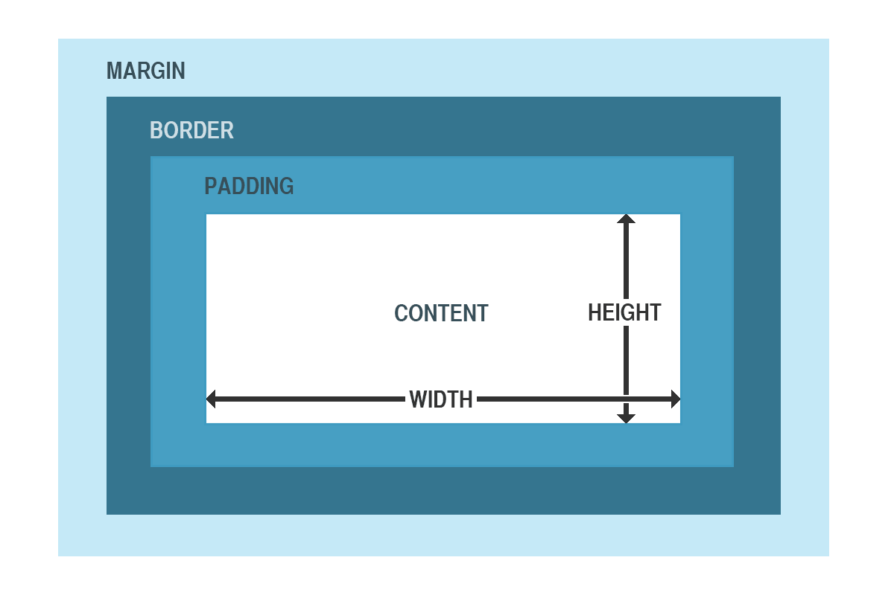

**Margin (Margen):**

- Propiedades: margin-top, margin-right, margin-bottom, margin-left o la propiedad abreviada margin.

Ejemplo con unidades de medida:

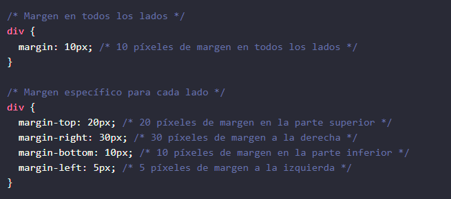

**Padding (Relleno):**

- Propiedades: padding-top, padding-right, padding-bottom, padding-left o la propiedad abreviada padding.

Ejemplo con unidades de medida:

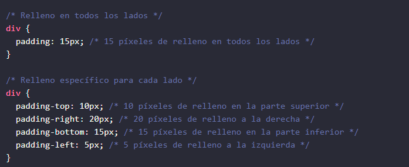

**Border (Borde):**

Propiedades: border-width, border-style, border-color, border-top, border-right, border-bottom, border-left, etc.

Ejemplo:

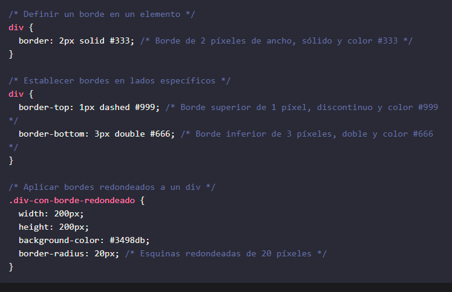

**Espaciado entre letras (letter-spacing):**

Propiedad: letter-spacing.

Ejemplo:

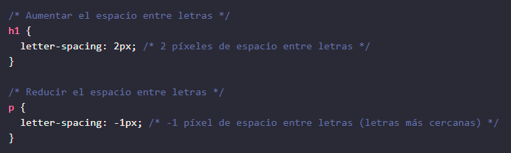

**Espaciado entre palabras (word-spacing):**

Propiedad: word-spacing.

Ejemplo:

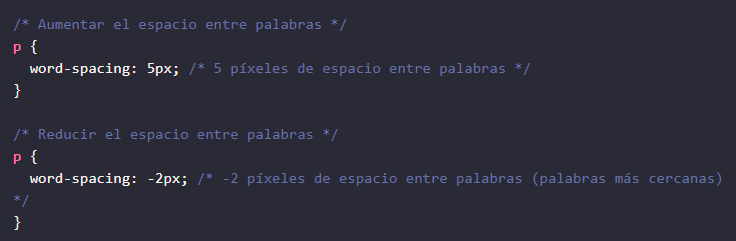

# **Unidades de medida más comunes en CSS**

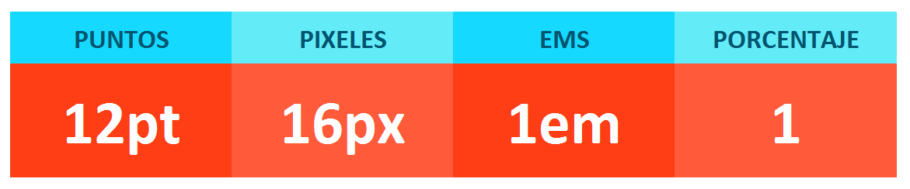

En el contexto de CSS (Cascading Style Sheets), las unidades de medida se utilizan para definir dimensiones y tamaños de elementos en una página web. CSS admite diversas unidades de medida que permiten especificar longitudes, anchuras, alturas, márgenes, rellenos y otros atributos dimensionales. Algunas de las unidades de medida más comunes en CSS incluyen:

**Píxeles (px): Representa los píxeles en la pantalla. 1px = 1 píxel de la pantalla. Es la unidad de medida más común y precisa.**

Ejemplo:

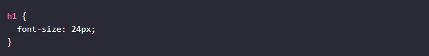

**Porcentaje (%): Se refiere al porcentaje del tamaño del elemento padre. Por ejemplo, el 50% de la altura del elemento padre.**

Ejemplo:

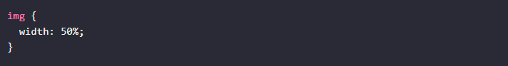

**Em: Basado en el tamaño de fuente del elemento. 1em = tamaño de fuente actual. Cambia si el tamaño de fuente cambia.**

Ejemplo:

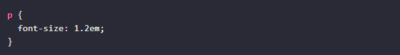

**Rem: Igual que em pero basado en el tamaño de fuente de la raíz <html> en lugar del elemento.**

Ejemplo:

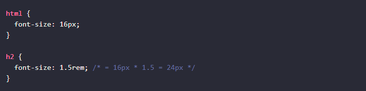

**Vw (view width): Ancho de la ventana viewport.**

Ejemplo:

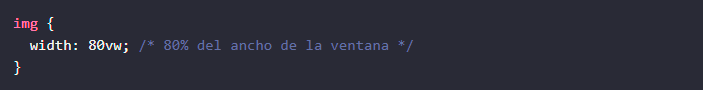

**Vh (view height): Altura de la ventana viewport.**

Ejemplo:

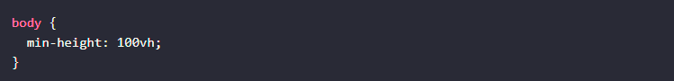

**Cm (centímetros): Representa el tamaño en centímetros. 1cm = 1/100 de metro.**

Ejemplo:

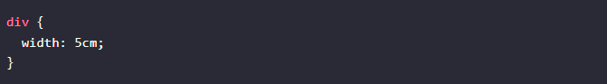

**Mm (milímetros): Representa el tamaño en milímetros. 1mm = 1/1000 de metro.**

Ejemplo:

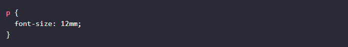

**In (pulgadas): Representa el tamaño en pulgadas. 1in = 2.54cm.**

Ejemplo:

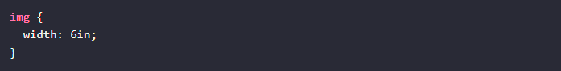

**Pt (puntos): Unidad tipográfica tradicional. 1pt = 1/72 de pulgada.**

Ejemplo:

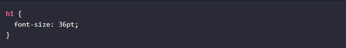

**Pc (picas): Otra unidad tipográfica. 1pc = 12pt.**

Ejemplo:

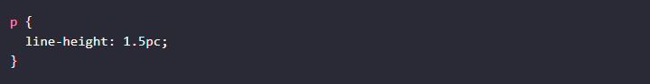